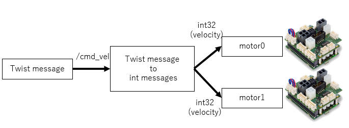

# EPOSx_ROS2
EPOSx Driver for ROS2.

There are no plans to improve the operation of the software as it is not currently being developed.

### Install

In "EPOSx_ROS2" directory...

```bash
$ sudo sh epos_single/EPOS_INSTALL/install.sh
$ cd ../../ && colcon build
$ source install/local_setup.bash
```

### How to use

To controll 2 motors by keyboard

```bash
## Terminal 1
$ ros2 run epos_single epos_node __params:=src/epos_single/yaml/epos0.yaml
## Terminal 2
$ ros2 run epos_single epos_node __params:=src/epos_single/yaml/epos1.yaml
## Terminal 3
$ ros2 run teleop_twist_keyboard teleop_twist_keyboard
## Terminal 4
$ ros2 run twist_2wheels_ros twist2wheels
```

### Caution

- Does not support anything other than Dashing

- I can't guarantee safety.

- You can't get motor(EPOS) status.

- Edit the Yaml file for all settings


### ROS2 topic communication


